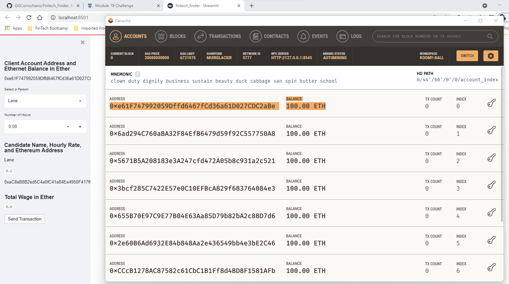
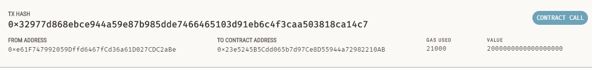
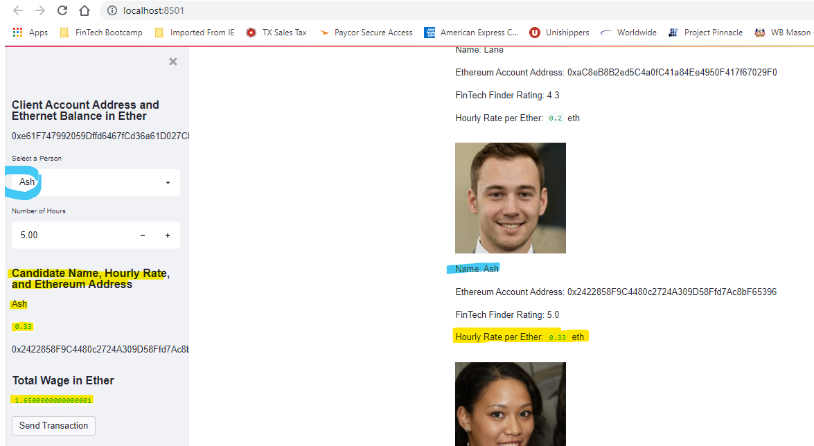
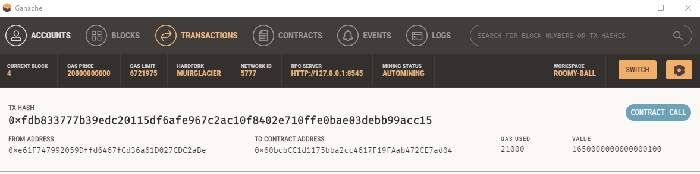
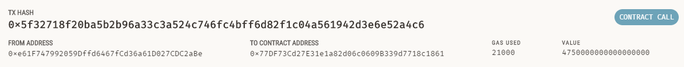
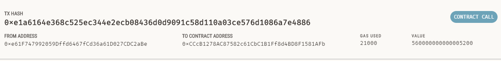
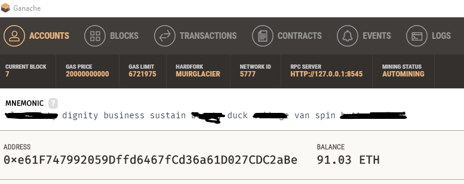

# Fintech Finder

Fintech Finder is an application that its customers can use to find fintech professionals from among a list of candidates, hire them, and pay them.

# Usage

Fintech Finder intergration to the Ethereum blockchain network, allows customers to instantly pay the fintech professionals whom they hire with cryptocurrency. Fintec Finder  utilizes the Streamlit open-source Python library to deploy a user interface.

# Visualization

# Contributing

Pull requests are welcome. Please open an issue to discuss before executing any changes.
Please make sure to update tests as needed.

# License
BSD-2-Clause https://opensource.org/licenses/BSD-2-Clause
